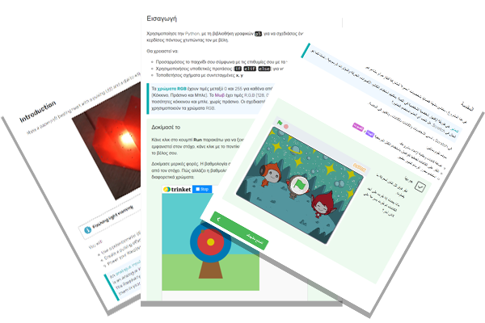

## Introduction

This guide is for facilitators using the Raspberry Pi Foundation's [321 Make! paths of projects](https://projects.raspberrypi.org/en/paths){:target="_blank"} in clubs and events. Parents and more experienced creators may also find this guide useful. 

**Terminology:** In this guide we refer to the adult club leaders, educators and mentors as **facilitators** and the young people they are supporting as **creators**.

Our global community of awesome young **creators** have been growing their skills by making projects in clubs and at home for over a decade. Through sharing their creations they have inspired their peers around the world. 

Each path is made up of three different types of project in a 3-2-1 structure:

+ **3 Explore** projects to introduce creators to a set of skills, and provide step-by-step instructions to help them develop initial confidence.
+ **2 Design** projects to allow creators to practise the skills they learned in the previous Explore projects, and to express themselves creatively whilst growing independence.
+ **1 Invent** project where creators meet a project brief for a particular audience using their skills.

We will cover:
+ The motivation behind creating 321 Make! and the new paths of projects
+ The different kinds of project in 321 Make!
+ Tips for using the paths in engaging sessions

We would love to hear your thoughts about 321 Make!, the paths and projects. As you work through this guide you will notice a 'Send feedback' button at the bottom of each step. This button appears on all our projects for you and your young creators to send feedback at any time. 