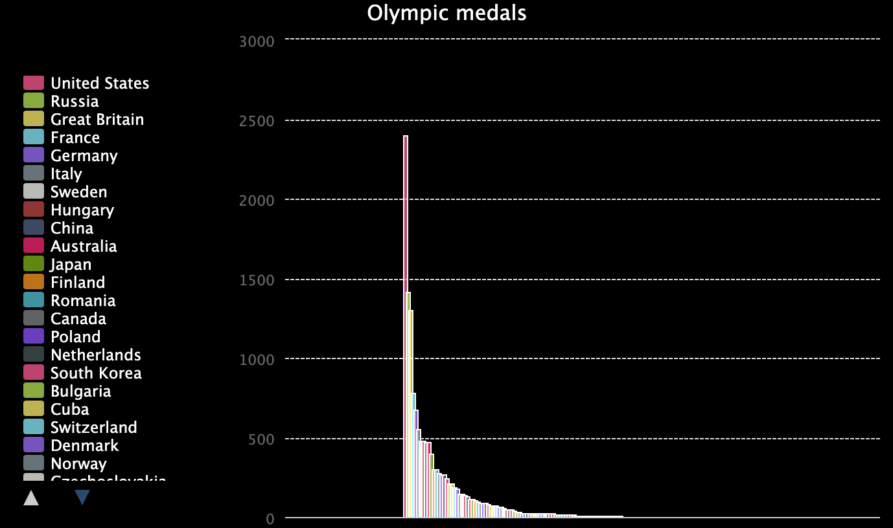
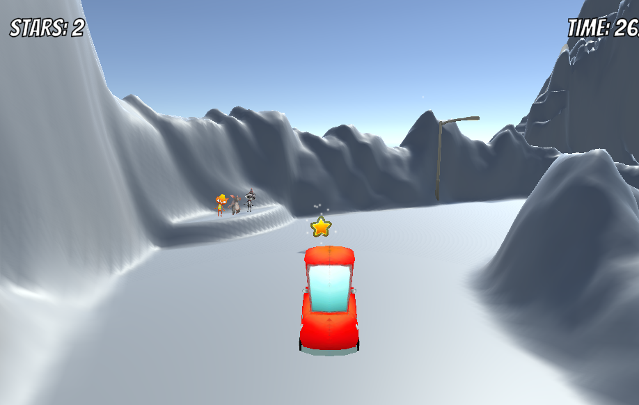

## Which paths are available?

This is a rough guide to the 🥉🥈🥇321 🏅Make! paths and the order in which they can be completed along with suggestions for additional content for practice and breadth. This should be adapted to your creators based on their prior experience of computing which will vary significantly around the world. 

### Code Club World

If your creators don’t have previous experience with computers and do have a good internet connection and are English-speaking then we’d recommend that they create an Avatar (a character) on [Code Club World](https://codeclubworld.org/){:target="_blank"} to experience dragging and dropping blocks on a computer or mobile device. When they are ready, they can move on to Scratch. 

### Age 7+ 

We have three paths of 🐱 Scratch projects plus a 🐱 Scratch physical computing path for the [Raspberry Pi computer](https://projects.raspberrypi.org/en/projects/raspberry-pi-getting-started){:target="_blank"}. 

**Start point** 

+ Start with 🥉🥈🥇🐱 [Intro to Scratch](https://projects.raspberrypi.org/en/pathways/scratch-intro){:target="_blank"}. No prior experience of Scratch is needed.

Don't forget to [Share](https://projects.raspberrypi.org/en/projects/share-scratch){:target="_blank"} the projects that creators make. 

--- collapse ---
---
title: Additional practice
---

**Additional practice:**

These existing projects and paths use similar skills to those introduced in Intro to Scratch and provide an opportunity for additional practice either before or after the Design and Invent projects. 

Projects and paths:
+ 🐱 [Look after yourself path](https://projects.raspberrypi.org/en/pathways/look-after-yourself){:target="_blank"}
+ 🐱 [Rock Band](https://projects.raspberrypi.org/en/projects/rock-band){:target="_blank"} 
+ 🐱 [Lost in Space](https://projects.raspberrypi.org/en/projects/lost-in-space){:target="_blank"} 
+ 🐱 [From me to you](https://projects.raspberrypi.org/en/projects/from-me-to-you){:target="_blank"}
+ 🐱 [3D scene](https://projects.raspberrypi.org/en/projects/3d-scene){:target="_blank"}
+ 🐱 [Interactive animation](https://projects.raspberrypi.org/en/projects/interactive-animation){:target="_blank"}
+ 🐱 [Shaun the Sheep: Mission to Space](https://projects.raspberrypi.org/en/projects/shauns-space-mission){:target="_blank"}

** 🏅Independent making:**

Use the 🐱 [I made you a book](https://projects.raspberrypi.org/en/projects/i-made-you-a-book){:target="_blank"} Invent project as a reference guide for reminders of the blocks and concepts that have been learned. 

Create a project that can be entered into the ✨ [Coolest Projects Showcase](https://projects.raspberrypi.org/en/projects/scratch-coolest-projects){:target="_blank"}. 

--- /collapse ---

**Next steps with blocks**

When your creators are ready to learn new skills choose a next path: 
+ 🥉🥈🥇🐱 [More Scratch](https://projects.raspberrypi.org/en/pathways/more-scratch){:target="_blank"} 

+ If you have access to Raspberry Pi computers: 🥉🥈🥇🐱 🚨[Intro to Scratch Physical Computing](https://projects.raspberrypi.org/en/pathways/physical-computing-with-scratch-and-the-raspberry-pi){:target="_blank"}.

+ You can complete these projects even you don't have a 3D printer, but they are even better if you do:[BlocksCAD 3D](https://projects.raspberrypi.org/en/pathways/blockscad-3d){:target="_blank"}.
+ If you have BBC micro:bits: [BBC micro:bit](https://projects.raspberrypi.org/en/codeclub/microbit){:target="_blank"}.

--- collapse ---
---
title: Additional practice
---

**Additional practice:** 

+ 🐱 [Weightlessness](https://projects.raspberrypi.org/en/projects/weightlessness){:target="_blank"}
+ 🐱 [Gravity simulator](https://projects.raspberrypi.org/en/projects/gravity-simulator){:target="_blank"}
+ 🐱 [Sprint!](https://projects.raspberrypi.org/en/projects/sprint){:target="_blank"} (This project cannot be completed on a tablet)
+ 🐱 [Chatbot](https://projects.raspberrypi.org/en/projects/chatbot){:target="_blank"}
+ 🐱 [Scratch cat goes skiing](https://projects.raspberrypi.org/en/projects/scratch-cat-goes-skiing){:target="_blank"}
+ 🐱 [Paint box](https://projects.raspberrypi.org/en/projects/paint-box){:target="_blank"}
+ 🐱 [Boat race](https://projects.raspberrypi.org/en/projects/boat-race){:target="_blank"}
+ 🐱 [An audiovisual e-card](https://projects.raspberrypi.org/en/projects/av-e-card){:target="_blank"}
+ 🐱 [Archery](https://projects.raspberrypi.org/en/projects/archery){:target="_blank"}
+ 🐱 [Beat the goalie](https://projects.raspberrypi.org/en/projects/beat-the-goalie){:target="_blank"}
+ 🐱 [How are you?](https://projects.raspberrypi.org/en/projects/how-are-you){:target="_blank"}
+ 🐱 [Grow a tree](https://projects.raspberrypi.org/en/projects/grow-a-tree){:target="_blank"}
+ 🐱 [Jazzy jumpers](https://projects.raspberrypi.org/en/projects/jazzy-jumpers){:target="_blank"}

🏅**Independent Making:**

Create a project that can be entered into the ✨ [Coolest Projects Showcase](https://projects.raspberrypi.org/en/projects/scratch-coolest-projects){:target="_blank"}. 

--- /collapse ---

### Age 11+

Either:

+ 🥉🥈🥇🐱 [Further Scratch](https://projects.raspberrypi.org/en/pathways/further-scratch){:target="_blank"}

+ 🥉🥈🥇🕸️ [Intro to Web](https://projects.raspberrypi.org/en/pathways/web-intro){:target="_blank"} - create web pages with HTML and CSS. 

+ 🥉🥈🥇🐍🚨 [Intro to Pico](https://projects.raspberrypi.org/en/pathways/pico-intro){:target="_blank"}. You will need inexpensive Raspberry Pi Pico microcontrollers and electronics components. See the path page for more details.

[Code Club Python Module 1](https://projects.raspberrypi.org/en/codeclub/python-module-1){:target="_blank"} and [Code Club Python Module 2](https://projects.raspberrypi.org/en/codeclub/python-module-2){:target="_blank"}. New Python paths for this age group coming soon!

--- collapse ---
---
title: Additional practice
---

**Additional practice:**

+ 🐱 [Synchronised Swimming](https://projects.raspberrypi.org/en/projects/synchronised-swimming){:target="_blank"}
+ 🐱 [Protect our planet](https://projects.raspberrypi.org/en/pathways/protect-our-planet){:target="_blank"}
+ 🐱 [Ghostbusters](https://projects.raspberrypi.org/en/projects/ghostbusters){:target="_blank"}
+ 🐱 [Code Club Scratch Module 2](https://projects.raspberrypi.org/en/codeclub/scratch-module-2){:target="_blank"}
+ 🐱 [Code Club Scratch Module 3](https://projects.raspberrypi.org/en/codeclub/scratch-module-3){:target="_blank"}
+ 🐱 [CoderDojo Scratch for Social Enterprise](https://projects.raspberrypi.org/en/coderdojo/scratch-for-social-enterprise){:target="_blank"}
+ 🐱 [Astronaut reaction game](https://projects.raspberrypi.org/en/projects/astronaut-reaction-times){:target="_blank"}

+ 🕸️ [CoderDojo HTML & CSS](https://projects.raspberrypi.org/en/coderdojo/21)

+ 🎶 [Sonic Pi path](https://projects.raspberrypi.org/en/codeclub/sonic-pi){:target="_blank"}
+ 🎶 [Code a carol](https://projects.raspberrypi.org/en/projects/code-a-carol){:target="_blank"}
+ ⛄ [Blender path](https://projects.raspberrypi.org/en/pathways/blender-basics){:target="_blank"}
+ 🐍 [Sense HAT path](https://projects.raspberrypi.org/en/codeclub/sense-hat){:target="_blank"} You can complete these projects with a Raspberry Pi Sense HAT or by using the Sense HAT emulator
+ 🚀 [Astro Pi Mission Zero](https://astro-pi.org/mission-zero/){:target="_blank"} - The competition runs each year, check the dates and entry requirements. No hardware required. Run your code in space!

🏅**Independent Making:**

Create a project that can be entered into the ✨ Coolest Project Showcase: [Python](https://projects.raspberrypi.org/en/projects/python-coolest-projects) [Web](https://projects.raspberrypi.org/en/projects/web-coolest-projects). There are categories for Scratch, Web, Games, Mobile apps and Hardware. 

--- /collapse ---

### Age 13+

+ 🥉🥈🥇🐍 [Intro to Python](https://projects.raspberrypi.org/en/pathways/python-intro){:target="_blank"}

+ 🥉🥈🥇🐍 [More Python](https://projects.raspberrypi.org/en/pathways/more-python){:target="_blank"}

+ 🥉🥈🥇[Intro to Unity](https://projects.raspberrypi.org/en/pathways/unity-intro){:target="_blank"}

+ 👁️ [Machine Vision](https://projects.raspberrypi.org/en/pathways/machine-vision){:target="_blank"}

**Additional practice:**

+ 🐍[Documenting your code](https://projects.raspberrypi.org/en/projects/documenting-your-code/){:target="_blank"}
+ 🕸️[Web development guide](https://projects.raspberrypi.org/en/projects/getting-started-web-dev){:target="_blank"}
+ 🐍🚨[Raspberry Pi Pico guide](https://projects.raspberrypi.org/en/projects/getting-started-with-the-pico){:target="_blank"}

🏅**Independent Making:**

Create a project that can be entered into the ✨ Coolest Project Showcase: [Python](https://projects.raspberrypi.org/en/projects/python-coolest-projects) [Web](https://projects.raspberrypi.org/en/projects/web-coolest-projects). There are categories for Scratch, Web, Games, Mobile apps and Hardware as well as an Advanced programming category. 

