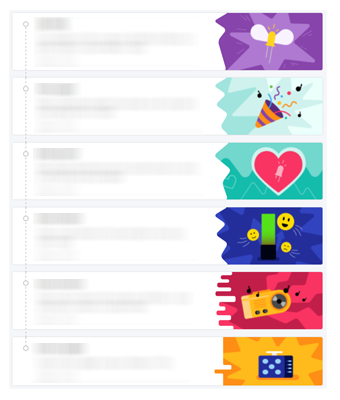
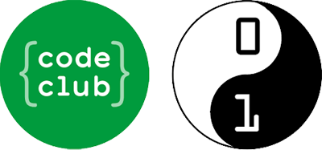
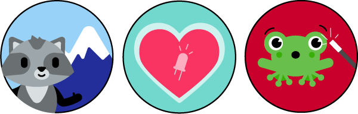

## What is a path? 

A path is a collection of **six** projects that cover a set of skills needed for a particular piece of hardware or software alongside design and engineering skills. As a result of working through a path, creators are empowered to build their own ideas and create solutions to situations they or their communities face, with increased independence. 

Currently, there are three levels of path:

+ '**Introduction to...**' these paths are for the creators' first introduction to the hardware or software. 
+ '**More...**' these paths follow on from the 'Introduction to' paths and build on those skills, while introducing new ones.
+ '**Further...**' these paths are currently the most advanced. They build on all of the skills covered in 'Introduction to' and 'More' paths, while also introducing new skills. 

### Progression within a path

All new skills are introduced in the first three fun Explore projects. Skills are revisited regularly to allow creators to use and experience them in different contexts. This helps to embed and deepen creators' understanding of how to apply those skills. 

As creators progress through the path, scaffolding is gently removed to help increase their independence. 

The path structure is designed to be flexible. If creators are already confident with the skills covered in the Explore projects, then they can go straight to the Design projects. If they aren't ready to start a Design project from scratch, then they could remix one of the example projects and adapt it with their own ideas. 

### Time needed for a path

Each project in a path should take about an hour to complete. There are additional upgrade steps in every project that can be used for creators who want to spend more time on their project.

### Age ranges for paths

Our programmes have age guidelines:

+ Code Club - ages 9 to 13
+ CoderDojo - ages 7 to 17

There are paths available for all creators in those age categories. Facilitators and parents should guide creators to the paths that are most suited to them. 

+ 'Introduction to Scratch' has projects that are aimed at our younger audience.

+ 'More Python' and 'Introduction to Unity' are aimed at our older audience. 

There is a lot of flexibility in path choice. Creators should explore the paths and choose the ones that interest them the most. However, it is important that they start at the 'Introduction' level if they are unfamiliar with the software or hardware being covered. 

### Guides

Guides are available for some of the areas covered in our new paths. These are really useful tools for you and your creators to dip in and out of and find additional support. The current available guides are:

+ [Getting started with Scratch](https://projects.raspberrypi.org/en/projects/getting-started-scratch){:target="_blank"}
+ [A guide to Unity](https://projects.raspberrypi.org/en/projects/unity-guide){:target="_blank"}
+ [Introduction to Raspberry Pi Pico](https://projects.raspberrypi.org/en/projects/introduction-to-the-pico/0){:target="_blank"}
+ [Getting started with web development](https://projects.raspberrypi.org/en/projects/getting-started-web-dev/0){:target="_blank"}

More guides are in development.

### Reflection time

Reflection steps have been built into each project within the path. This could be time to complete a quiz or for creators to check that they have met the project brief.

Reflection time is another opportunity for creators to revisit and remind themselves of the key skills covered in the project. The quizzes should be seen as another opportunity to learn and not an official assessment. 

### Badges

At the end of each project, the creators are awarded with a project badge. If your creators have an account, then they can collect and view their badges there. 

### Research links

+ As creators **progress** through a path, the activities allow for growth while reducing frustrations. 
+ Starting with **step-by-step** activities builds motivation. Moving on to **guided activities** where creators make **design choices** allows for increased independence.
+ Beginning with **direct instruction** and then moving on to **independent** projects increases creators' engagement and motivation.
+ Invent projects allow creators to work on projects that **matter to them**. This means that they are more engaged with the activity, which makes them willing to expand their projects and learn more. 
+ Projects across a path are carefully considered to ensure that they appeal to a wide, global audience. 

