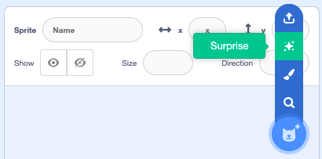

## Two Design projects  

**Design** means making decisions about the function or appearance of a project. Design includes software engineering, visual design, usability, and accessibility.  

In **Design** projects, creators take more responsibility for deciding exactly what to make and which computing concepts to use. The outputs of Design projects are much more varied than the output of Explore projects. 

Creators have a wide range of experiences and progress at different speeds. To support this, we:
+ Structure Design projects so that they build up gradually. 
+ Acknowledge all steps don't need to be completed for creators to have something to be proud of.
+ Do not specify a time limit. If your group enjoys making a Design project and needs more time, then you could continue for another session.

### Introduction step

The Introduction step gives creators several inspirational examples of what they could create. They are encouraged to have fun trying the example projects and explore their code. 

Prompts are provided to get creators to pay attention to what is **similar** across the projects and what is **different**. Creators use this knowledge as input into their designs. 

This example from our [Make a face](https://projects.raspberrypi.org/en/projects/make-a-face){:target="_blank"} project encourages creators to think about how they can use geometric shapes to make their faces: 

--- task ---

### Get inspiration 

You are going to make some design decisions about the kind of face you will make.

  

Look at these examples and think about how they have both been made from shapes. How have circles, ellipses, squares, rectangles, and triangles been used to create different faces?

**Kawaii fruit**: [See inside](https://trinket.io/python/6bad88800b){:target="_blank"}

  <iframe src="https://trinket.io/embed/python/6bad88800b?outputOnly=true&start=result" width="450" height="450" frameborder="0" marginwidth="0" marginheight="0" allowfullscreen>
  </iframe>

**Tribal mask**: [See inside](https://trinket.io/python/b876d500ab){:target="_blank"}

  <iframe src="https://trinket.io/embed/python/b876d500ab?outputOnly=true&start=result" width="450" height="450" frameborder="0" marginwidth="0" marginheight="0" allowfullscreen>
  </iframe>

--- /task ---

**Tip:** If you are limited for time or have creators who need more support, then they can start from one of the examples and remix it instead of completely creating their own project. 

**Tip:** If you have time, it's a good idea to show creators the example design projects the session before, or encourage them to try them at home, so that they have time to think about their own ideas. 

**Tip:** For our Scratch paths, you can see the remixes other creators have made by visiting the starter project page for each. This example from our [Silly eyes project page](https://scratch.mit.edu/projects/582221984/remixes){:target="_blank"} contains many inspirational projects you might want to share some with your creators.  

### Choose your theme Step

Design projects usually have a step where creators are encouraged to think about the theme for their project. 

In this step of the Unity [World builder](https://projects.raspberrypi.org/en/projects/world-builder){:target="_blank"} Design project, creators start to design their world and character:

--- task ---

Think about the kind of world you want to make:

+ What kind of biome, habitat, geography, or weather system will it have?
+ Will it be based on somewhere in the real world, an imagined planet, or based on a book or movie you enjoy?

What kind of character will the Player be in your world? Will you use a model or make a character from 3D shapes?

--- /task ---

**Tip:** It's a good idea to have some paper and pencils available for creators who prefer to sketch their ideas. Access to a document editor is useful for those who prefer to make digital notes. 

It is important that young people see that computing and digital making addresses topics that are meaningful to them. This step is an opportunity for creators to:

+ **Make the project culturally or locally relevant**: You could make an example project to show them how the project can be made with a theme that you know will be relevant to your young creators. 
+ **Make the project personally relevant**: Explain that the knowledge they have from their hobbies and interests is really valuable when making computing projects. 

**Tip:** Some young people who are technically very capable struggle to think of their own ideas. They could try and recreate one of the examples without looking at the code. 

## Creation steps 

The main steps in a Design project have tasks that guide creators through the stages of making the project. 

Design projects model the decomposition of a project into manageable steps. At the end of each step, creators have a part or feature of their project working. 

Design projects include **Choose** tasks where creators are offered a choice. These include content decisions such as graphics, colours, and text, and will influence the functionality of their project. For example, the selection of a character could influence the way they move. A leopard would move quickly while a snail would move slowly. 

This example from our [Silly eyes](https://projects.raspberrypi.org/en/projects/silly-eyes){:target="_blank"} Design project includes three different ways a creator could **choose** their sprite:

--- task ---

**Choose:** Choose a sprite **or** create your own simple sprite in the Paint editor.

You don't have to choose a person or animal. You could choose an object, like the donut.

[[[generic-scratch3-sprite-from-library]]]

[[[scratch3-backdrops-and-sprites-using-shapes]]]

--- collapse ---
---
title: Get a surprise sprite
---

Not sure which sprite to choose? Go to the **Choose a Sprite** menu and choose the **Surprise** option to add a surprise sprite to your project.

--- /collapse ---

--- /task ---

Design projects include all the code snippets that creators need. These are provided in **info cards**. The concepts in the provided code will be familiar from the preceding Explore projects. Creators need to modify the code snippets for their project. 

Where possible we provide an example project with code that can be reused via the Scratch backpack or code that can be used through copy and paste. 

This example from our [Surprise! animation](https://projects.raspberrypi.org/en/projects/suprise-animation){:target="_blank"} Design project includes an info card with an example of how to create a walking animation. 

--- task ---

The character could be brave and move closer to check out the object.

[[[scratch3-animate-movement-costumes]]]

--- /task ---

**Tip:** Professional software developers often reuse code, it's not cheating! It's much more important that creators understand what a unit of code does than that they remember how to reproduce it line by line. 

Creation steps also include regular **Test:** tasks. This encourages creators to get into the habit of testing code when ever they have made a change with a visible outcome and to view their project from a user's perspective. The **Test:** tasks are less specific than in Explore projects as each project will be different but we give kinds on the kinds of behaviour to test for. 

This example from our [Don't fall in](https://projects.raspberrypi.org/en/projects/dont-fall-in){:target="_blank"} Design project includes details of what to test and look out for: 

--- task ---

**Test:** Click the green flag and then jump your character across the Stage. Make sure you hear the winning sound when you reach the End platform.

**Tip:** It’s really important that you test your project before moving to the next step and adding more code. It’s harder to find and fix bugs when you have added more code.

--- /task ---

Design projects include **Debug:** tasks with advice on how to spot and fix the specific kinds of bug that they are likely to encounter at this point in the project. 

**Tip:** When a creator asks for help in a Design project, encourage them to check the **Debug:** tasks and see if they can help. This encourages independence and accurately identifying the problem. 

This **Debug:** task from our [Mood indicator](https://projects.raspberrypi.org/en/projects/mood-indicator){:target="_blank"} Design project details some common bugs and encourages celebrating any new bugs found. 

--- task ---

**Debug:** You might find some bugs in your project that you need to fix. Here are some common bugs.

[[[debug-pico-code]]]
[[[debug-pico-hardware]]]

If you find a bug that is not listed here, can you work out how to fix it?

We love hearing about your bugs and how you fixed them. Use the 'Send feedback' button at the bottom of this page and tell us if you found a different bug in your project.

--- /task ---
### Reflection Step

Like Explore projects, Design projects have three multiple choice questions. These questions generally fall into two categories:

+ **Technical questions** that are outside a specific context. Where the questions in Explore projects are usually in the context of the specific project that has been made, technical questions in a Design project use less familiar examples. 
+ **Design questions**. These questions could ask about best practices (such as giving variables informative names) or could be related to the relevance of computing (such as why it makes sense to use code to solve a problem). 

As with Explore projects, the reflection questions are not intended as an formal assessment. Instead they give provide an opportunity to revisit and embed important concepts so that creators will be prepared for future projects. 

### Upgrade your project Step

As with Explore projects, this step allows **differentiation by outcome** and allows creators who have additional time or want to continue at home to take their project further.

This step often includes an inspirational example that we would not expect all creators to be able to achieve. 

**Tip:** It's important to remind young people how long it takes a big team to make a piece of software. They are creating amazing projects in much less time. They are awesome.

### Share Step

In this step, creators will be guided through sharing their project. This could include in-person sharing as well as online sharing. 

Creators will have the opportunity to share their project with the Raspberry Pi Foundation community by submitting to a Studio or Gallery. 

In this example from our [Next customer please](https://projects.raspberrypi.org/en/projects/next-customer-please){:target="_blank"} there are several ideas given for how to share projects. 

--- task ---

If you are logged in on Scratch, you can create a studio and add your **Next customer please** project. You can also add your friends' **Next customer please** projects to create a market of different shops and businesses.

--- collapse ---

---

title: Build a shopping market

---

Save your project, then click on your username and select **My Stuff**.

From your **My Stuff** page, click on the **+ New Studio** button.

Give your new studio a name and description. 

Click on the **Add projects** button. You can add yor own project by selecting it from the list at the bottom of the page.

You can also add projects your friends have created. Ask them to share their project and give you the link. Type or paste the link into the url box, then click the **Add by url** button. 

--- /collapse ---

Inspire the Raspberry Pi Foundation community with your project!

To submit your project to our ['Intergalactic shopping market'](https://scratch.mit.edu/studios/29662180){:target="_blank"} Scratch studio, please complete [this form](https://form.raspberrypi.org/f/community-project-submissions){:target="_blank"}.

--- /task ---

### What next step

Design projects end with a **what next** step that has links to the path overview and the next project in the path. 

It's a great idea to introduce your young people to the next project they will be doing so that they can start thinking about what they will make. 

### Further reading:

--- collapse ---

---
title: Research and software engineering
---

+ Offering **choice** increases engagement by making projects more relevant and meaningful to young people. 
+ Each design project comes with four [**worked examples**](https://blog.teachcomputing.org/using-worked-examples-to-support-novice-learners/){:target="_blank"} that creators can review to understand how the projects were made. 
+ Starter projects and guided instructions provide a [**plan** with **subgoals**](https://blog.teachcomputing.org/using-worked-examples-to-support-novice-learners/){:target="_blank"} which helps to break a project down into achievable parts.
+ Allowing creators to become familiar with concepts and skills in Explore projects before asking them to apply those skills creatively manages the [**cognitive load**](https://blog.teachcomputing.org/pedagogy-bytes-quick-reads-for-busy-educators/){:target="_blank"} that they experience on the path to becoming independent makers. 
+ Use-Modify-Create and [PRIMM](https://blog.teachcomputing.org/using-primm-to-structure-programming-lessons/){:target="_blank"} advocate gradually transferring ownership of code from the educator to the learner.
+ **Debugging** is often reported as a difficult area for beginners. We are able to give context-specific **Debug:** steps in Design projects.
+ The structured guidance for making personally relevant projects increases chances of success and the development of [**self-efficacy**](https://www.raspberrypi.org/blog/digital-divide-socioeconomic-disadvantage-computing-education/){:target="_blank"}.
+ Professional software developers often use **design patterns** to capture best practices in an area of computing.  
+ Design projects encourage regular **testing** and **debugging** which are important software engineering practices and also support the development of **executive functioning** skills. 
+ Giving creators access to best practice code snippets helps to avoid the **Turing tarpit** where beginners are given environments where they could do anything but it's hard to do cool stuff. 
+ Software developers progress from writing code that has been designed by others to taking more responsibility for design. 
+ Design projects cover **software design skills** such as good modularity and best practices for naming. They also include design for **usability** and **accessibility**.

--- /collapse ---

 
