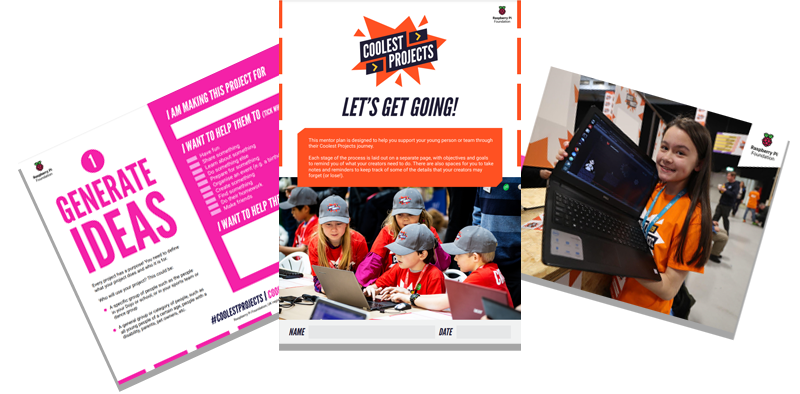

## Make! projects 

As a result of working through a path, learners are empowered to develop their own ideas and create solutions to situations they or their communities face, with increased independence. 

Creators can use the skills they've gained, along with reference materials, to create something totally new and unique.

### Make! another invent project

The Invent projects have been designed to be flexible when it comes to the context and the skills that creators want to showcase. If your creator needs some scafolding to come up with their own project idea then you can encourage them to make another example of the Invent project for a different context or theme. 

### Timescale

Independent making can be carried out over various time periods depending on your constraints. You could run a single session or allocate several weeks to team based projects.  

### Encourage collaboration

**Pair programming**

A pair programming approach can support creators to develop programs and problem solve more successfully. Application of this approach is more than simply asking two creators to work together and involves them taking on two different roles: driver and navigator.

A [quick read](https://blog.teachcomputing.org/quick-read-pair-programming-supports-learners/){:target="_blank"} is available if you would like more information on pair programming. 

**Team work**

Every creator is an individual who will have different interests and skills. Some might really enjoy creating artwork for characters and backdrops, others might prefer to spend time on perfecting the accuracy of providing scores for a game. Having a wide range of skills in a group can be a real asset to a project. 

When working on Make! projects, encourage your creators to work in teams with people that have different skillsets to them. They can then assign roles and learn how to work together to produce something really cool. 

### Coolest Projects Guidance

Coolest Projects is the world’s leading technology showcase for young people. It's a unique opportunity to get creative, have fun, and celebrate ingenuity! Young people from all over the world submit their creations to a global showcase, which is then shortlisted and judged by a panel of technology and social action experts from around the globe. 

If you're working with a group of young people who are making things with technology, there are several resources available from the [Coolest Projects guidance page](https://online.coolestprojects.org/guidance){:target="_blank"} to help you support them through the design process:
+ A printable [Youth Workbook](http://rpf.io/cpworkbook){:target="_blank"} which can be scribbled in, worked on and referred to during the making process, with questions and guidance on making something they care about.
+ A printable [Mentor Guide](http://rpf.io/cpmentorplan){:target="_blank"} to support you when leading your sessions.
+ Accompanying [slide decks](https://online.coolestprojects.org/guidance#:~:text=DOWNLOAD%20THE%20WORKBOOK-,SESSION%20PLANS,-These%20slides%20are){:target="_blank"} with prompts and discussion points for you to use when leading sessions, broken into four stages of the design and prototyping process.

### Enter Coolest Projects

Once your budding makers have created something they're proud of, why not enter it in the Coolest Projects Global Showcase? 

All levels of skill and experience are encouraged, even if you’ve never made anything before in your life! If you’re looking for some inspiration, take a look at the [showcase gallery for 2022](http://rpf.io/showcase22){:target="_blank"}, and go to the [Coolest Projects website](https://coolestprojects.org){:target="_blank"} for the latest information.

### Use the technology-specific guides

These technology-specific guides provide useful reference materials for a wide range of basic digital making skills. The recently developed guides feature the same info cards that creators will be familiar with from Design and Invent projects. 

+ [Getting started with Raspberry Pi](https://projects.raspberrypi.org/en/projects/raspberry-pi-getting-started){:target="_blank"}
+ [Getting started with soldering](https://projects.raspberrypi.org/en/projects/getting-started-with-soldering){:target="_blank"}
+ [Getting started with git](https://projects.raspberrypi.org/en/projects/getting-started-with-git){:target="_blank"}
+ [Getting started with GUIs](https://projects.raspberrypi.org/en/projects/getting-started-with-guis/){:target="_blank"}
+ [Getting started with Scratch](https://projects.raspberrypi.org/en/projects/getting-started-scratch){:target="_blank"}
+ [Getting started with Picamera](https://projects.raspberrypi.org/en/projects/getting-started-with-picamera){:target="_blank"}
+ [Getting started with the SenseHAT](https://projects.raspberrypi.org/en/projects/getting-started-with-the-sense-hat/){:target="_blank"}
+ [A guide to Unity](https://projects.raspberrypi.org/en/projects/unity-guide){:target="_blank"}
+ [Introduction to the Raspberry Pi Pico](https://projects.raspberrypi.org/en/projects/introduction-to-the-pico/){:target="_blank"}

### When creators are ready to move on

When your creators are ready to move on, they can go for the next path in the series or they can try a path from a different piece of hardware or software. 
