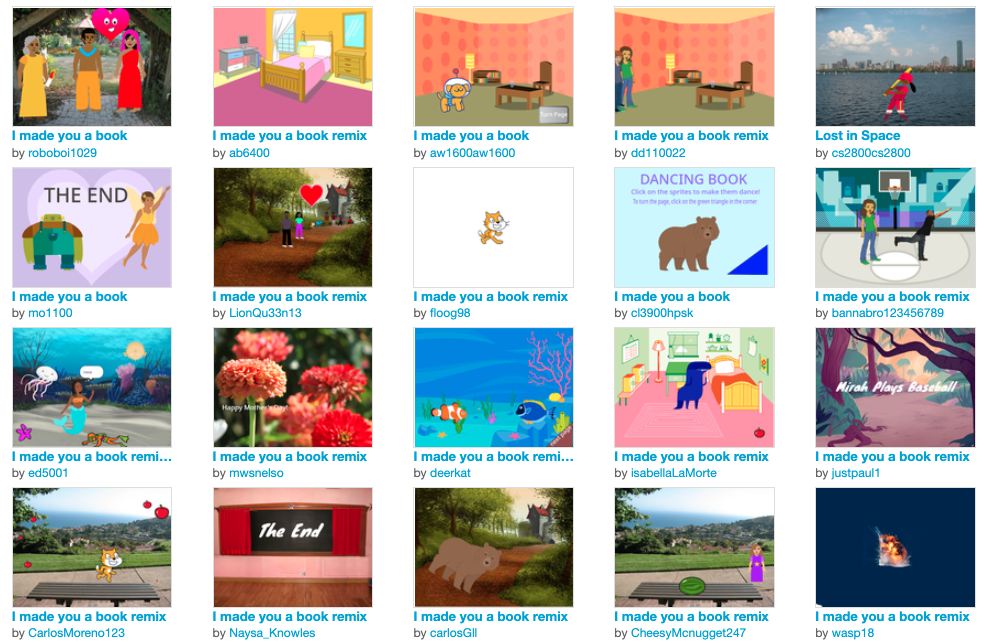

## Make it matter

### Culturally responsive computing

**Culturally relevant pedagogy** emphasises the importance of including and valuing creators’ knowledge, ways of learning and culture.

Culturally responsive pedagogy is embedded into the 321 Make! projects. 

**321 Make!**

+ **Is designed for all**

Projects are written for an audience that is global and has a wide variety of contexts and needs. Projects can also be adapted to match the needs of your setting and make them more relevant.   

--- task ---

**Tip:** When you work through the design and invent projects before your club session why not use your knowledge of your creators to create an example that means more to them. You can showcase this as one of the examples for generating ideas at the start of the session. 

--- /task ---

+ **Values creators' interests** 

As creators progress through 321 Make! there are increasing opportunities to bring in their own interests and make projects that matter to them. This example from the 'Powerful patterns' project uses the Lapis Sarawak Malaysian cake:

**Kek lapis Sarawak**: [See inside](https://trinket.io/python/81be7eb895){:target="_blank"}

  <iframe src="https://trinket.io/embed/python/81be7eb895?outputOnly=true&start=result" width="600" height="500" frameborder="0" marginwidth="0" marginheight="0" allowfullscreen>
  </iframe>

--- task ---

**Tip:** Talk to creators about their hobbies, culture and issues that matter to them as well as topics of local and topical interest. Explain that their knowledge is really valuable when creating technology projects - a project always needs to be about something. Be aware that creators from minority groups may not feel comfortable being seen as a representative of their community, it can be better to have individual conversations than group discussions. 

--- /task ---

+ **Values creativity** 

Design and invent projects develop creative problem solving skills that allow creators to make projects that are entertaining, usable and visually appealling. Each creator brings their own thinking and unique style which enables them to make projects that only they could have created.

These examples from the 'I made you a book' project show a range of books from creators:

--- task ---

**Tip:** Discuss how computing projects can be inspired by heritage including traditional stories, music and art as well as modern culture, fashion and computer games. Celebrate personal and unique thinking and style that creators put in to their projects. 

--- /task ---

+ **Multiple native languages** 

Our projects are available in <mark>Sabina to provide text.</mark>

--- task ---

**Tip:** Offer creators the opportunity to use the projects in their choice of language. Show creators how to switch language on the project site. This is a good way to engage parents or encourage creators to continue at home.

--- /task ---

+ **Empowers creators** 

Our projects include boxouts and project topics related to ethics, social justice, wellness and environmental issues. Here are examples from our 'Party popper' and 'Hello world' projects:

**Light and sound shows** using technology are being used in celebrations worldwide. These **sustainable** and **reusable** options create fun displays and interactive entertainments. Now, instead of disposable items like plastic party poppers or chemical fireworks, people are celebrating with drones, lasers, and projection shows!

The **yellow heart emoji** is often used to show friendship and happiness.

  

--- task ---

**Tip:** Encourage creators to think about how they can use technology to make the world a better place. 

--- /task ---

+ **Introduces real role models**

Projects include boxouts with quotes and facts about role models relevant to that topic. Here are examples from our 'Hello world' and '3D adventure' projects:

Japanese computer scientist **Emma Haruka Iwao** used a computer to calculate the value of Pi (π) to 31 trillion digits. That answer is so long that it would take over 300,000 years just to say it!

“Computers are the best tool we have to think a thing, and then quickly bring that thing into the world in a way that other humans understand it.” **Timoni West, Unity**
 

--- task ---

**Tip:** Boxouts can be used as discussion points within sessions. They have been designed to showcase a diverse range of role models but are also a good opportunity to discuss examples and achievements of real role models that are local or share culture with your creators. 

--- /task ---

+ **Provides additional assets**

The upgrade step of [Flip treat webcards](https://projects.raspberrypi.org/en/projects/flip-treat-webcards/6){:target="_blank"} includes assets created in response to suggestions from our global club community.

--- task ---

**Tip:** If a creator enjoys using a particular asset you could encourage them to save it for quick use in future projects. Local storage or tools like the [Scratch backpack](https://projects.raspberrypi.org/en/projects/scratch-backpack){:target="_blank"} can be used to provide quick access for favourite assets.

--- /task ---

--- collapse ---
---
title: Research links
---

+ The Raspberry Pi Foundation has produced a [guide](https://www.raspberrypi.org/blog/culturally-relevant-computing-curriculum-guidelines-for-teachers/){:target="_blank"} on culturally relevant computing which contains more information and examples on making computing culturally relevant. 

--- /collapse ---